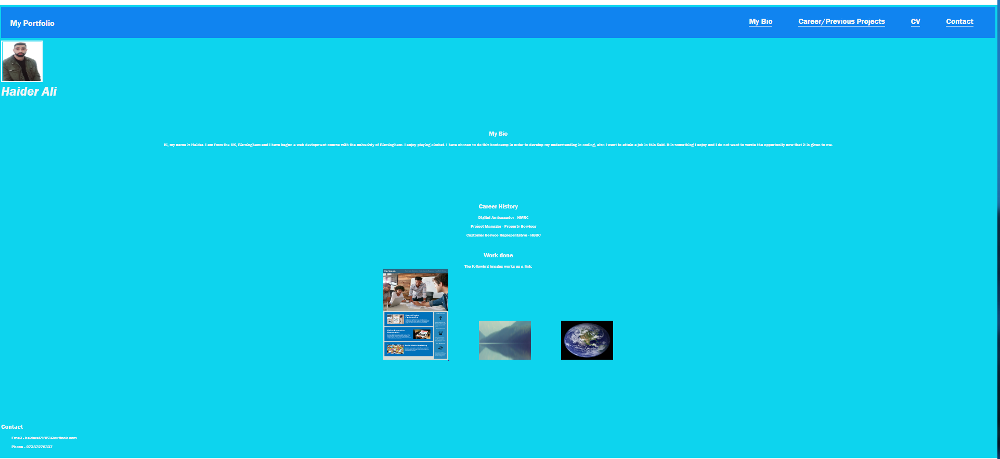

# haider-porfolio02
## Designing a Portfolio Project
In this project, I needed to design a portfolio in order to display my experience as a web developer in order to satisfy the user story, see below. I started to project without any starter code and used the knowledge I have gained from my lessons as well as my reserach on google to develop this portfolio.

Throughout this challenge, I have utilised skills that I have learnt such as: flexbox, media queries and other css variables in order to design the lay out of my website.

## User Story
AS AN employer
I WANT to view a potential employee's deployed portfolio of work samples
SO THAT I can review samples of their work and assess whether they're a good candidate for an open position

## Acceptance Criteria
Here are the critical requirements necessary to develop a portfolio that satisfies a typical hiring manager’s needs:

GIVEN I need to sample a potential employee's previous work
WHEN I load their portfolio
THEN I am presented with the developer's name, a recent photo, and links to sections about them, their work, and how to contact them
WHEN I click one of the links in the navigation
THEN the UI scrolls to the corresponding section
WHEN I click on the link to the section about their work
THEN the UI scrolls to a section with titled images of the developer's applications
WHEN I am presented with the developer's first application
THEN that application's image should be larger in size than the others
WHEN I click on the images of the applications
THEN I am taken to that deployed application
WHEN I resize the page or view the site on various screens and devices
THEN I am presented with a responsive layout that adapts to my viewport

## Mock-Up
The following picture is a screenshot of my portfolio:

<section>
    
</section>

# Servers
HTML
CSS

## URL

https://github.com/haiderali1998/haider-porfolio02
